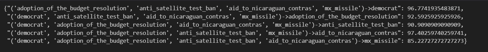
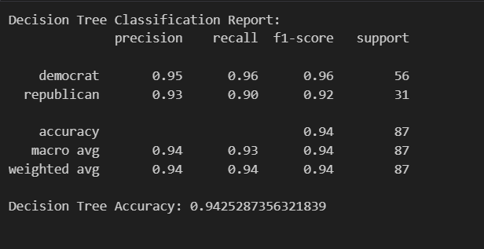

### **Project Name:**
**Congressional Voting Patterns Analysis: Association Rules and Decision Trees**

---

### **Project Description:**
This project analyzes the voting patterns of U.S. Congress members in 1984 to understand the relationship between their votes on key issues and their political party affiliation (Democrat or Republican). The dataset includes 16 key votes, and the analysis is performed using two methods:
1. **Association Rule Mining**: To discover interesting relationships between votes and party affiliation.
2. **Decision Tree Classification**: To predict party affiliation based on voting patterns.

The project is implemented from scratch without using pre-built libraries for association rule mining, making it a great learning resource for understanding the underlying algorithms.

---

### **Key Features:**
- **Data Preprocessing**: Handles missing values, encodes categorical data, and prepares the dataset for analysis.
- **Association Rule Mining**: Implements the Apriori algorithm from scratch to discover meaningful rules between votes and party affiliation.
- **Decision Tree Classification**: Uses a Decision Tree model to predict party affiliation based on voting patterns.
- **Comprehensive Evaluation**: Evaluates both methods using metrics like support, confidence, lift (for association rules) and accuracy, precision, recall (for Decision Trees).

---

### **Technologies Used:**
- Python
- Pandas (for data manipulation)
- Scikit-learn (for Decision Tree implementation)
- NumPy (for numerical operations)

---

### **Dataset:**
The dataset used in this project is the **1984 United States Congressional Voting Records**, which includes votes on 16 key issues for 435 Congress members (267 Democrats and 168 Republicans). Each vote is recorded as "yea" (1), "nay" (0), or "unknown" (handled as missing data).
NOTE: It is important to recognize that "?" in this database does 
         not mean that the value of the attribute is unknown.  It 
         means simply, that the value is not "yea" or "nay" (see 
         "Relevant Information" section above).

#### **Dataset Features:**
1. **Class Name**: Party affiliation (Democrat or Republican).
2. **16 Voting Issues**: Including: 
    handicapped-infants: 2 (y,n)
    water-project-cost-sharing: 2 (y,n)
    adoption-of-the-budget-resolution: 2 (y,n)
    physician-fee-freeze: 2 (y,n)
    el-salvador-aid: 2 (y,n)
    religious-groups-in-schools: 2 (y,n)
    anti-satellite-test-ban: 2 (y,n)
    aid-to-nicaraguan-contras: 2 (y,n)
    mx-missile: 2 (y,n)
    immigration: 2 (y,n)
    synfuels-corporation-cutback: 2 (y,n)
    education-spending: 2 (y,n)
    superfund-right-to-sue: 2 (y,n)
    crime: 2 (y,n)
    duty-free-exports: 2 (y,n)
    export-administration-act-south-africa: 2 (y,n)

---

### **How to Use:**
1. Clone the repository:
   ```bash
   git clone https://github.com/sedwna/Congressional-Voting-Patterns-Analysis--Association-Rules-and-Decision-Trees.git
   ```

2. Install the required libraries:
   ```bash
   pip install -r requirements.txt
   ```

3. Run the analysis notebook:
   - Open the `main.ipynb` notebook.
   - Run all cells to preprocess the data, Association rules, and Decision tree.

4. Check the results:
   - Association rules will be displayed in the console.
   - Decision Tree evaluation metrics (accuracy, precision, recall, F1-score) will be printed.

### Example results

  
*Association rules*

  
*accuracy, precision, recall, F1-score*
---

### **Implementation Details:**

#### **1. Association Rule Mining (Apriori Algorithm)**
- The Apriori algorithm is implemented from scratch to discover rules such as:
  - `{physician-fee-freeze = 1} -> {Class Name = Republican}`
  - `{education-spending = 0} -> {Class Name = Democrat}`
- Metrics like **support**, **confidence**, and **lift** are calculated for each rule.

#### **2. Decision Tree Classification**
- A Decision Tree model is trained to predict party affiliation based on voting patterns.
- The model is evaluated using metrics like **accuracy**, **precision**, **recall**, and **F1-score**.

---

### **Results:**
- **Association Rules**: Discovered rules reveal strong relationships between specific votes and party affiliation. For example:
  - Republicans are more likely to support the "physician-fee-freeze" bill.
  - Democrats are more likely to oppose the "el-salvador-aid" bill.
- **Decision Tree**: The model achieves high accuracy in predicting party affiliation based on voting patterns.

---

### **Project Structure:**
```
congressional-voting-analysis/
│
├── data/
│   └── house-votes-84.data  # Dataset file
│
├── src/
│   └── main.ipynb           # Script for Association Rule Mining and Decision Tree Classification
│
├── requirements.txt         # List of dependencies
└── README.md                # Project documentation

```

---

### **Contributing:**
Contributions are welcome! If you'd like to contribute, please follow these steps:
1. Fork the repository.
2. Create a new branch for your feature or bugfix.
3. Commit your changes and push to the branch.
4. Submit a pull request.

---

### **Acknowledgments:**
- The dataset is sourced from the UCI Machine Learning Repository.
- Special thanks to the open-source community for providing valuable resources and tools.

---

### **Contact:**
For any questions or feedback, feel free to reach out:
- **Your Name**
- **Email**: sajaddehqan2002@gmail.com
- **LinkedIn**: [[My LinkedIn Profile](https://www.linkedin.com/in/sajad-dehqan-189a0b258/)]

---

### **GitHub Repository:**
[Congressional Voting Patterns Analysis](https://github.com/sedwna/Congressional-Voting-Patterns-Analysis--Association-Rules-and-Decision-Trees)

---
